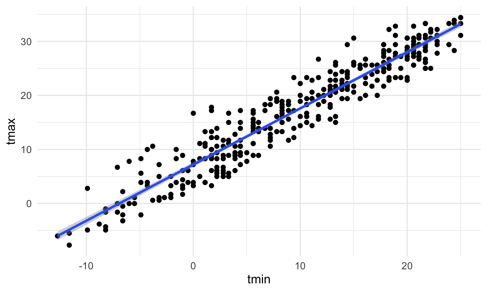
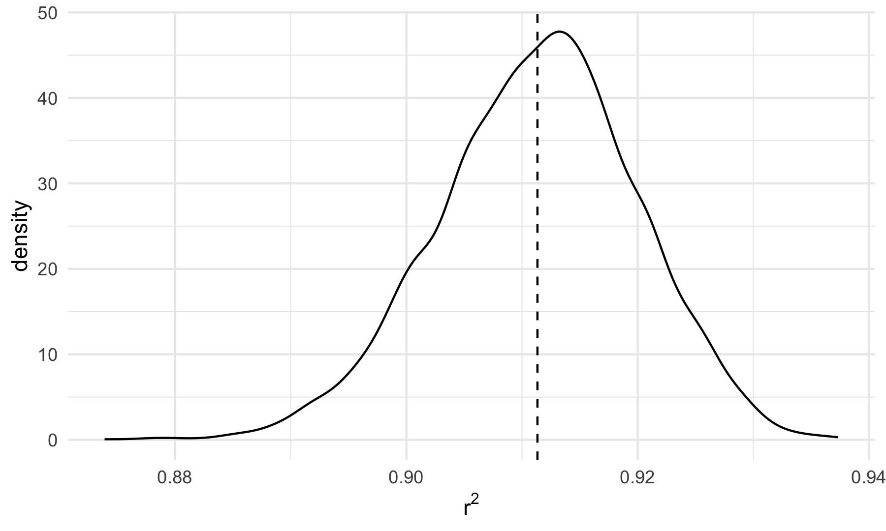
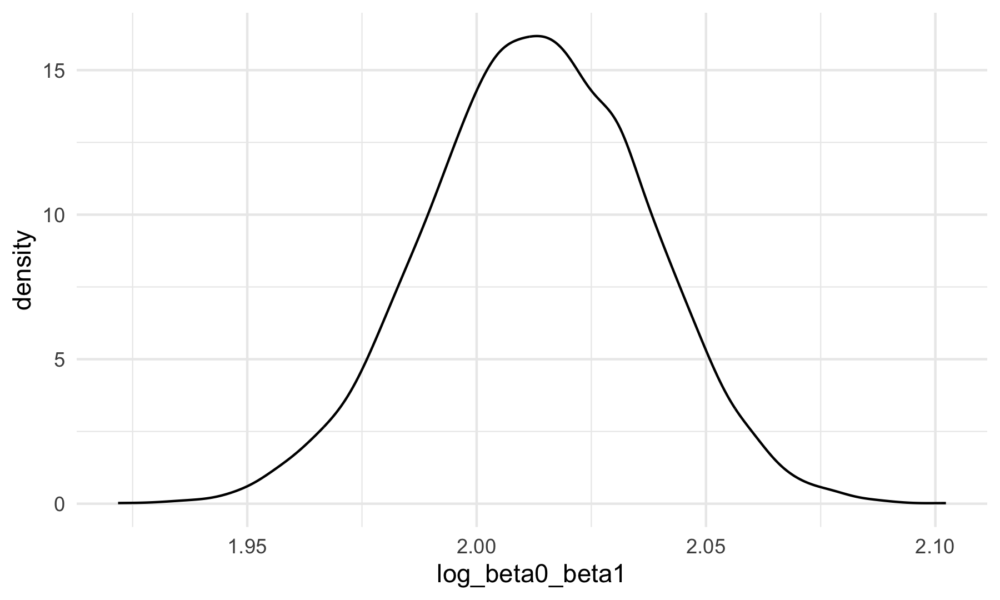

p8105 HW6
================
Ravi Brenner
2024-11-19

# Introduction

# Methods

# Problems

## Problem 1

Get 2017 Central park data from the web

``` r
weather_df = 
  rnoaa::meteo_pull_monitors(
    c("USW00094728"),
    var = c("PRCP", "TMIN", "TMAX"), 
    date_min = "2017-01-01",
    date_max = "2017-12-31") %>%
  mutate(
    name = recode(id, USW00094728 = "CentralPark_NY"),
    tmin = tmin / 10,
    tmax = tmax / 10) %>%
  select(name, id, everything())
```

    ## using cached file: /Users/ravibrenner/Library/Caches/org.R-project.R/R/rnoaa/noaa_ghcnd/USW00094728.dly

    ## date created (size, mb): 2024-09-26 10:17:27.971396 (8.651)

    ## file min/max dates: 1869-01-01 / 2024-09-30

The boostrap is helpful when you’d like to perform inference for a
parameter / value / summary that doesn’t have an easy-to-write-down
distribution in the usual repeated sampling framework. We’ll focus on a
simple linear regression with tmax as the response and tmin as the
predictor, and are interested in the distribution of two quantities
estimated from these data:

Write our very simple linear model, using tmax as the outcome and tmin
as the predictor. We’ll write a function to extract the two values we’re
interested in, r^2 and log(beta0hat \* beta1hat)

``` r
weather_fit <- lm(tmax ~ tmin, data = weather_df)

value_extract <- function(model) {
  r_squared <- model |>
    broom::glance() |>
    select(r.squared) |>
    pull()
  
  beta0 <- model |>
    broom::tidy() |>
    filter(term == "(Intercept)") |>
    select(estimate) |>
    pull()
  
  beta1 <- model |>
    broom::tidy() |>
    filter(term == "tmin") |>
    select(estimate) |>
    pull()
  
  output <- tibble(r_squared = r_squared,
                   log_beta0_beta1 = log(beta0 * beta1))
  return(output)
}

value_extract(weather_fit)
```

    ## # A tibble: 1 × 2
    ##   r_squared log_beta0_beta1
    ##       <dbl>           <dbl>
    ## 1     0.912            2.01

plot of this model

``` r
weather_df |>
  ggplot(aes(x = tmin, y = tmax)) + 
  geom_point() + 
  geom_smooth(method = "lm")
```

    ## `geom_smooth()` using formula = 'y ~ x'



𝑟̂ 2 log(𝛽̂ 0∗𝛽̂ 1)

Use 5000 bootstrap samples and, for each bootstrap sample, produce
estimates of these two quantities. Plot the distribution of your
estimates, and describe these in words. Using the 5000 bootstrap
estimates, identify the 2.5% and 97.5% quantiles to provide a 95%
confidence interval for 𝑟̂ 2 and log(𝛽̂ 0∗𝛽̂ 1) . Note: broom::glance() is
helpful for extracting 𝑟̂ 2 from a fitted regression, and broom::tidy()
(with some additional wrangling) should help in computing log(𝛽̂ 0∗𝛽̂ 1)

Bootstrap 5000 times

``` r
boot_results <- weather_df |>
  modelr::bootstrap(5000) |>
  mutate(strap = map(strap, as_tibble),
         models = map(strap, \(df) lm(tmax ~ tmin, data = df)),
         results = map(models, value_extract)) |>
  select(.id, results) |>
  unnest(results) 
```

Plot these distributions

``` r
boot_results |>
  ggplot(aes(x = r_squared)) +
  geom_density()
```



``` r
boot_results |>
  ggplot(aes(x = log_beta0_beta1)) +
  geom_density()
```



2.5% and 97.5% quantiles (i.e. 95% CI) for these values.

``` r
boot_results |>
  pivot_longer(cols  = -.id, 
               names_to = "var",
               values_to = "value") |>
  group_by(var) |>
  summarize(boot_est = mean(value),
            boot_ci_ll = quantile(value, 0.025),
            boot_ci_ul = quantile(value, 0.975))
```

    ## # A tibble: 2 × 4
    ##   var             boot_est boot_ci_ll boot_ci_ul
    ##   <chr>              <dbl>      <dbl>      <dbl>
    ## 1 log_beta0_beta1    2.01       1.96       2.06 
    ## 2 r_squared          0.911      0.894      0.927

## Problem 2

## Problem 3

# Conclusion
