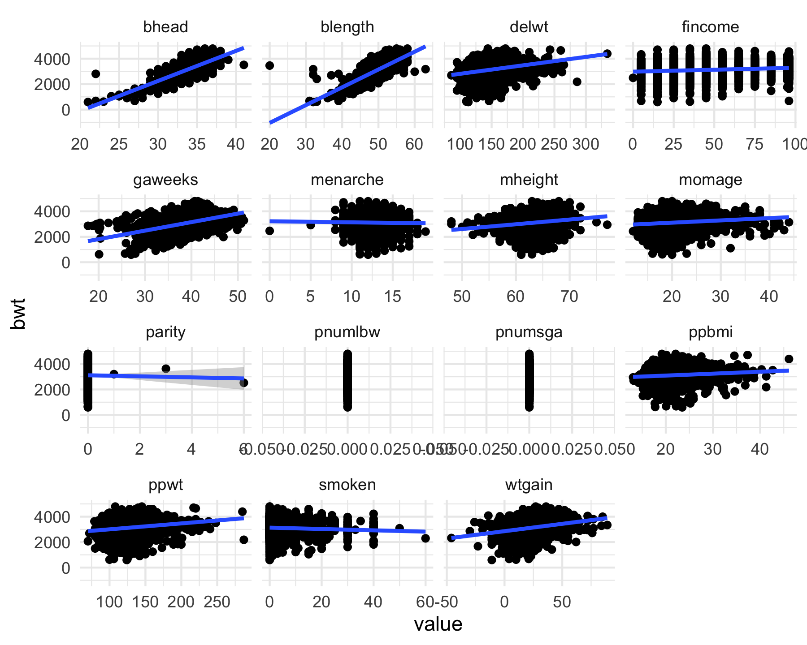

p8105 HW6
================
Ravi Brenner
2024-11-19

# Introduction

# Methods

# Problems

## Problem 1

Get 2017 Central park data from the web

``` r
weather_df = 
  rnoaa::meteo_pull_monitors(
    c("USW00094728"),
    var = c("PRCP", "TMIN", "TMAX"), 
    date_min = "2017-01-01",
    date_max = "2017-12-31") %>%
  mutate(
    name = recode(id, USW00094728 = "CentralPark_NY"),
    tmin = tmin / 10,
    tmax = tmax / 10) %>%
  select(name, id, everything())
```

    ## using cached file: /Users/ravibrenner/Library/Caches/org.R-project.R/R/rnoaa/noaa_ghcnd/USW00094728.dly

    ## date created (size, mb): 2024-09-26 10:17:27.971396 (8.651)

    ## file min/max dates: 1869-01-01 / 2024-09-30

The boostrap is helpful when you’d like to perform inference for a
parameter / value / summary that doesn’t have an easy-to-write-down
distribution in the usual repeated sampling framework. We’ll focus on a
simple linear regression with tmax as the response and tmin as the
predictor, and are interested in the distribution of two quantities
estimated from these data:

Write our very simple linear model, using tmax as the outcome and tmin
as the predictor. We’ll write a function to extract the two values we’re
interested in, r^2 and log(beta0hat \* beta1hat)

``` r
weather_fit <- lm(tmax ~ tmin, data = weather_df)

value_extract <- function(model) {
  r_squared <- model |>
    broom::glance() |>
    select(r.squared) |>
    pull()
  
  beta0 <- model |>
    broom::tidy() |>
    filter(term == "(Intercept)") |>
    select(estimate) |>
    pull()
  
  beta1 <- model |>
    broom::tidy() |>
    filter(term == "tmin") |>
    select(estimate) |>
    pull()
  
  output <- tibble(r_squared = r_squared,
                   log_beta0_beta1 = log(beta0 * beta1))
  return(output)
}

value_extract(weather_fit)
```

    ## # A tibble: 1 × 2
    ##   r_squared log_beta0_beta1
    ##       <dbl>           <dbl>
    ## 1     0.912            2.01

plot of this model

``` r
weather_df |>
  ggplot(aes(x = tmin, y = tmax)) + 
  geom_point() + 
  geom_smooth(method = "lm")
```

    ## `geom_smooth()` using formula = 'y ~ x'


𝑟̂ 2 log(𝛽̂ 0∗𝛽̂ 1)

Use 5000 bootstrap samples and, for each bootstrap sample, produce
estimates of these two quantities. Plot the distribution of your
estimates, and describe these in words. Using the 5000 bootstrap
estimates, identify the 2.5% and 97.5% quantiles to provide a 95%
confidence interval for 𝑟̂ 2 and log(𝛽̂ 0∗𝛽̂ 1) . Note: broom::glance() is
helpful for extracting 𝑟̂ 2 from a fitted regression, and broom::tidy()
(with some additional wrangling) should help in computing log(𝛽̂ 0∗𝛽̂ 1)

Bootstrap 5000 times

``` r
boot_results <- weather_df |>
  bootstrap(5000) |>
  mutate(strap = map(strap, as_tibble),
         models = map(strap, \(df) lm(tmax ~ tmin, data = df)),
         results = map(models, value_extract)) |>
  select(.id, results) |>
  unnest(results) 
```

Plot these distributions

``` r
boot_results |>
  ggplot(aes(x = r_squared)) +
  geom_density()
```


``` r
boot_results |>
  ggplot(aes(x = log_beta0_beta1)) +
  geom_density()
```


2.5% and 97.5% quantiles (i.e. 95% CI) for these values.

``` r
boot_results |>
  pivot_longer(cols  = -.id, 
               names_to = "var",
               values_to = "value") |>
  group_by(var) |>
  summarize(boot_est = mean(value),
            boot_ci_ll = quantile(value, 0.025),
            boot_ci_ul = quantile(value, 0.975))
```

    ## # A tibble: 2 × 4
    ##   var             boot_est boot_ci_ll boot_ci_ul
    ##   <chr>              <dbl>      <dbl>      <dbl>
    ## 1 log_beta0_beta1    2.01       1.96       2.06 
    ## 2 r_squared          0.911      0.894      0.927

## Problem 2

The Washington Post has gathered data on homicides in 50 large U.S.
cities and made the data available through a GitHub repository here. You
can read their accompanying article here.

Create a city_state variable (e.g. “Baltimore, MD”), and a binary
variable indicating whether the homicide is solved. Omit cities Dallas,
TX; Phoenix, AZ; and Kansas City, MO – these don’t report victim race.
Also omit Tulsa, AL – this is a data entry mistake. For this problem,
limit your analysis those for whom victim_race is white or black. Be
sure that victim_age is numeric.

First importing the data, and doing some data cleaning to ensure that we
have only valid data. We’re only interested in white or black race, so
we will also filter based on that.

``` r
homicide_df <- read_csv("data/homicide-data.csv") |>
  mutate(city_state = str_c(city,", ",state),
         solved = if_else(disposition == "Closed by arrest",TRUE, FALSE),
         victim_age = as.numeric(victim_age)) |>
  filter(!city_state %in% c("Dallas, TX",
                            "Phoenix, AZ",
                            "Kansas City, MO",
                            "Tulsa, AL"),
         victim_race %in% c("White","Black"))
```

    ## Rows: 52179 Columns: 12
    ## ── Column specification ────────────────────────────────────────────────────────
    ## Delimiter: ","
    ## chr (9): uid, victim_last, victim_first, victim_race, victim_age, victim_sex...
    ## dbl (3): reported_date, lat, lon
    ## 
    ## ℹ Use `spec()` to retrieve the full column specification for this data.
    ## ℹ Specify the column types or set `show_col_types = FALSE` to quiet this message.

    ## Warning: There was 1 warning in `mutate()`.
    ## ℹ In argument: `victim_age = as.numeric(victim_age)`.
    ## Caused by warning:
    ## ! NAs introduced by coercion

For the city of Baltimore, MD, use the glm function to fit a logistic
regression with resolved vs unresolved as the outcome and victim age,
sex and race as predictors. Save the output of glm as an R object; apply
the broom::tidy to this object; and obtain the estimate and confidence
interval of the adjusted odds ratio for solving homicides comparing male
victims to female victims keeping all other variables fixed.

``` r
baltimore_fit <- glm(solved ~ victim_age + victim_sex + victim_race, 
                     family = binomial,
                     data = homicide_df)
```

Function to get estimate and 95% CI of the adjusted OR for solving
homicides comparing male to female victims, holding all other variables
fixed

``` r
or_ci <- function(model) {
  broom::tidy(model, conf.int = TRUE) |>
    mutate(or = exp(estimate),
           or_low = exp(conf.low),
           or_high = exp(conf.high)) |>
    filter(term == "victim_sexMale") |>
    select(or,or_low,or_high) 
}

or_ci(baltimore_fit)
```

    ## # A tibble: 1 × 3
    ##      or or_low or_high
    ##   <dbl>  <dbl>   <dbl>
    ## 1 0.603  0.569   0.639

Now run glm for each of the cities in your dataset, and extract the
adjusted odds ratio (and CI) for solving homicides comparing male
victims to female victims. Do this within a “tidy” pipeline, making use
of purrr::map, list columns, and unnest as necessary to create a
dataframe with estimated ORs and CIs for each city.

``` r
city_male_or <- homicide_df |>
  nest(.by = city_state) |>
  mutate(models = map(data, \(df) glm(solved ~ victim_age + victim_sex + victim_race,
                                      family = binomial,
                                      data = df)),
         results = map(models, or_ci)) |>
  select(city_state, results) |>
  unnest(results)
```

    ## Warning: There were 44 warnings in `mutate()`.
    ## The first warning was:
    ## ℹ In argument: `results = map(models, or_ci)`.
    ## Caused by warning:
    ## ! glm.fit: fitted probabilities numerically 0 or 1 occurred
    ## ℹ Run `dplyr::last_dplyr_warnings()` to see the 43 remaining warnings.

Create a plot that shows the estimated ORs and CIs for each city.
Organize cities according to estimated OR, and comment on the plot.

``` r
city_male_or |>
  mutate(city_state = fct_reorder(city_state, or)) |>
  ggplot(aes(y = city_state, x = or)) + 
  geom_point() +
  geom_errorbar(aes(xmin = or_low, xmax = or_high)) + 
  geom_vline(xintercept = 1, linetype = "dashed")
```


Cities to the left of 1, odds of murder being solved are lower for male
victims than female victims (odds ratio \< 1). Cities to the right of
OR=1, odds of murder being solved are higher for males than females.
Based on the 95% CI, there are no cities where the odds for a murder
being solves for males is higher than 1 with 95% confidence (?)

## Problem 3

In this problem, you will analyze data gathered to understand the
effects of several variables on a child’s birthweight. This dataset,
available here, consists of roughly 4000 children and includes the
following variables:

babysex: baby’s sex (male = 1, female = 2) bhead: baby’s head
circumference at birth (centimeters) blength: baby’s length at birth
(centimeteres) bwt: baby’s birth weight (grams) delwt: mother’s weight
at delivery (pounds) fincome: family monthly income (in hundreds,
rounded) frace: father’s race (1 = White, 2 = Black, 3 = Asian, 4 =
Puerto Rican, 8 = Other, 9 = Unknown) gaweeks: gestational age in weeks
malform: presence of malformations that could affect weight (0 = absent,
1 = present) menarche: mother’s age at menarche (years) mheigth:
mother’s height (inches) momage: mother’s age at delivery (years) mrace:
mother’s race (1 = White, 2 = Black, 3 = Asian, 4 = Puerto Rican, 8 =
Other) parity: number of live births prior to this pregnancy pnumlbw:
previous number of low birth weight babies pnumgsa: number of prior
small for gestational age babies ppbmi: mother’s pre-pregnancy BMI ppwt:
mother’s pre-pregnancy weight (pounds) smoken: average number of
cigarettes smoked per day during pregnancy wtgain: mother’s weight gain
during pregnancy (pounds)

Load and clean the data for regression analysis (i.e. convert numeric to
factor where appropriate, check for missing data, etc.).

``` r
bwt_df <- read_csv("data/birthweight.csv") |>
  mutate(babysex = factor(babysex, labels = c("male","female")),
         frace = factor(frace, 
                        levels = c(1,2,3,4,8,9),
                        labels = c("White","Black","Asian","Puerto Rican","Other","Unknown")),
         mrace = factor(mrace, 
                        levels = c(1,2,3,4,8),
                        labels = c("White","Black","Asian","Puerto Rican","Other")),
         malform = factor(malform,
                          level = c(0,1),
                          labels = c("absent","present")))
```

    ## Rows: 4342 Columns: 20
    ## ── Column specification ────────────────────────────────────────────────────────
    ## Delimiter: ","
    ## dbl (20): babysex, bhead, blength, bwt, delwt, fincome, frace, gaweeks, malf...
    ## 
    ## ℹ Use `spec()` to retrieve the full column specification for this data.
    ## ℹ Specify the column types or set `show_col_types = FALSE` to quiet this message.

Propose a regression model for birthweight. This model may be based on a
hypothesized structure for the factors that underly birthweight, on a
data-driven model-building process, or a combination of the two.
Describe your modeling process and show a plot of model residuals
against fitted values – use add_predictions and add_residuals in making
this plot.

Not knowing much about this data, I first want to understand the
relationship between each of these variables vs. birthweight. I can
accomplish this by plotting them in a grid. To do this I will separate
out the numeric and factor variables:

``` r
bwt_df |>
  select(where(is.numeric)) |>
  pivot_longer(-bwt,
               names_to = "covariate",
               values_to = "value") |>
  ggplot(aes(x = value, y = bwt)) + 
  geom_point() + 
  geom_smooth(method = "lm") + 
  facet_wrap(~covariate, scales = "free_x")
```

    ## `geom_smooth()` using formula = 'y ~ x'


``` r
bwt_df |>
  select(bwt, !where(is.numeric)) |>
  pivot_longer(-bwt,
               names_to = "covariate",
               values_to = "value") |>
  ggplot(aes(x = value, y = bwt)) + 
  geom_boxplot() + 
  facet_wrap(~covariate, scales = "free_x")
```



Based on these, I will focus on the numeric variables. Seeing that there
is a negative relationship with smoken (number of cigarette’s smoked), I
want to include that while controlling for covariates like blength,
gaweeks, ppbmi (since this captures both mheight and ppwt), and wtgain,
which should give an estimate for the impact of smoking on birthweight
controlling for some more “structural” factors

My hypothesized model

``` r
speculative_fit <- lm(bwt ~ smoken + blength + gaweeks + ppbmi + wtgain,
                      data = bwt_df)
```

show a plot of model residuals against fitted values – use
add_predictions and add_residuals in making this plot.

``` r
add_residuals(bwt_df, speculative_fit)  |>
  add_predictions(speculative_fit) |>
  ggplot(aes(x = pred, y = resid)) + 
  geom_point()
```


Compare your model to two others:

One using length at birth and gestational age as predictors (main
effects only)

``` r
len_age_fit <- lm(bwt ~ blength + gaweeks,
                  data = bwt_df)
```

One using head circumference, length, sex, and all interactions
(including the three-way interaction) between these

``` r
interact_fit <- lm(bwt ~ bhead * blength * babysex,
                   data = bwt_df)
```

Make this comparison in terms of the cross-validated prediction error;
use crossv_mc and functions in purrr as appropriate.

``` r
cv_df <- 
  crossv_mc(bwt_df, 100) |>
  mutate(
    train = map(train, as_tibble),
    test = map(test, as_tibble)
  ) 

cv_res_df <- cv_df |>
  mutate(
    spec_mod = map(train, \(x) lm(bwt ~ smoken + blength + gaweeks + ppbmi + wtgain, data = x)),
    len_age_mod = map(train, \(x) lm(bwt ~ blength + gaweeks, data = x)),
    interact_mod = map(train, \(x) lm(bwt ~ bhead * blength * babysex, data = x))
    ) |>
  mutate(
    rmse_spec = map2_dbl(spec_mod, test, rmse),
    rmse_len_age = map2_dbl(len_age_mod, test, rmse),
    rmse_interact = map2_dbl(interact_mod, test, rmse)
  )
```

``` r
cv_res_df |>
  select(starts_with("rmse")) |>
  pivot_longer(everything(),
               names_to = "model",
               values_to = "rmse",
               names_prefix = "rmse_") |>
  ggplot(aes(x = model, y = rmse)) +
  geom_violin()
```


Note that although we expect your model to be reasonable, model building
itself is not a main idea of the course and we don’t necessarily expect
your model to be “optimal”.

# Conclusion
